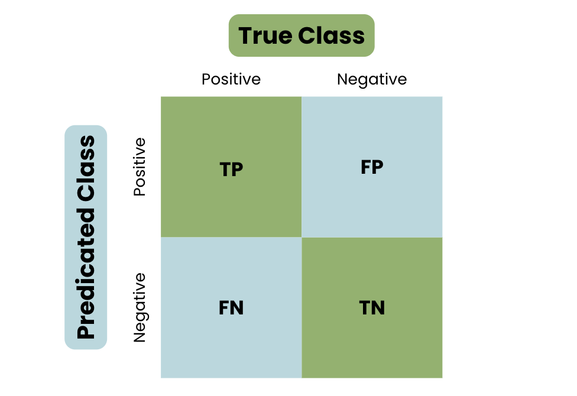

\n

```{css, echo=FALSE}
.rounded-box {
  background-color: #002060; 
  color: white;
  border-radius: 10px; 
  box-shadow: 0 2px 5px rgba(0, 0, 0, 0.2);
  padding: 20px; 
  width: 800px; 
  text-align: center;
}
.rounded-box-w {
  background-color: #002060; 
  color: white;
  border-radius: 10px; 
  box-shadow: 0 2px 5px rgba(0, 0, 0, 0.2);
  padding: 20px; 
  width: 800px; 

}
.slide-header {
  background-color: #002060;
  color: white;
  padding: 20px;
  text-align: center;
  font-size: 36px;
}
```
```{r, include=FALSE}
knitr::opts_chunk$set(echo = TRUE)
```
<div class="slide-header">
  AI Aliens Proposal
</div>
## Team Members


```{r, warning=FALSE, include=FALSE}
library(dplyr)
library(kableExtra)
library(tidyr)
```

```{r, echo=FALSE, fig.align='center'}
# Create dataframe with names
df_names <- data.frame(
  `Member 1` = "Archit Chawla",
  `Member 2` = "Robby Connor",
  `Member 3` = "Vamshi Kanisetty",
  `Member 4` = "Hermanth Kona"
)
df_names%>%
  kbl() %>%
  kable_material_dark()

```
## Project Description  

* **ISSUE** Create a method to discover Bias within machine learning models by user 
**_____________________________________________________________________**  
* Create a model that identify bias
  * Machine Learning is only insightful if true
* Use the fairness model to train 100 models
* use the models train to predict a fairness for other models from the hugging face api


<div class="rounded-box-w">
    filefobject <- fairness_check(explainer_lm,
    protected = german$Sex,
    privileged = "male"
    )
</div>


## Analytical Methods  
* [fairness](https://journal.r-project.org/articles/RJ-2022-019/#)
* [fairadapt](https://cran.r-project.org/web/packages/fairadapt/index.html)
* [fairmodels](https://cran.r-project.org/web/packages/fairmodels/index.html)
    * [A detailed guide on fairmodels](https://cran.r-project.org/web/packages/fairmodels/fairmodels.pdf)
* Use the Hugging Face API to pull in other tags and descriptors 


## Evaluation Plan
* Utilize the F1 score to find the best match of recall and perceision  
<div class="rounded-box">  
  
  2(precision * recall)  
F1 = **---------------------------------------------------------------------------**    
  precision + recall  
</div>
* Provide the confusion to provide all metrics
<div style="text-align: left;">
    
</div>

